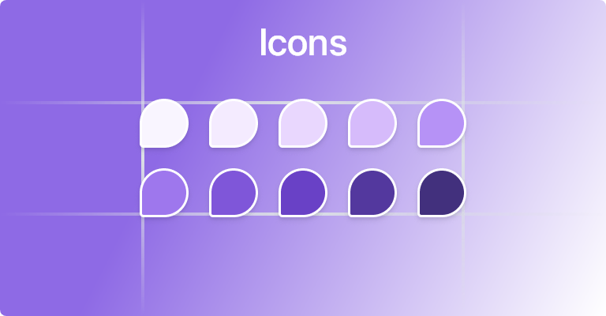

# Untitled UI Icons

### A collection of fully customizable icons from Untitled UI

- ### 🛠 Supports `.js` `.ts` `.tsx` `.jsx` extensions ; completely typesafe
- ### 🚀 All icons are sourced from Untitled UI
- ### ⚡ Completed with **500+** Icons
- ### 🤝🏽Support and contributions are welcomed
- ### 🤗 Currently available for React but Vue js & Qwik js versions are in development

# Docs

- ### npm install :

```js
npm install untitledui-js
```

- ### Usage :

```jsx
import { useRef } from "react";
import { Home01 } from "untitledui-js";

const ExampleComponent = () => {
  const ref = useRef(null);
  
  return (

     <Home01 ref={ref} size="60px" stroke="2px" {...props} />

  )
};

export default ExampleComponent;
```



- ### **Props** : All Components have access to all SVG properties like  `className, stroke, strokeWidth, fill, strokeColor, etc`

- ### **Naming Convention** : Components are defined with Camelcase. for example `home-01 -> Home01, activity-01 -> Activity01`

- ### **Icon Categories** : Covers full range of untilted icons categories essentially, all icons are available

