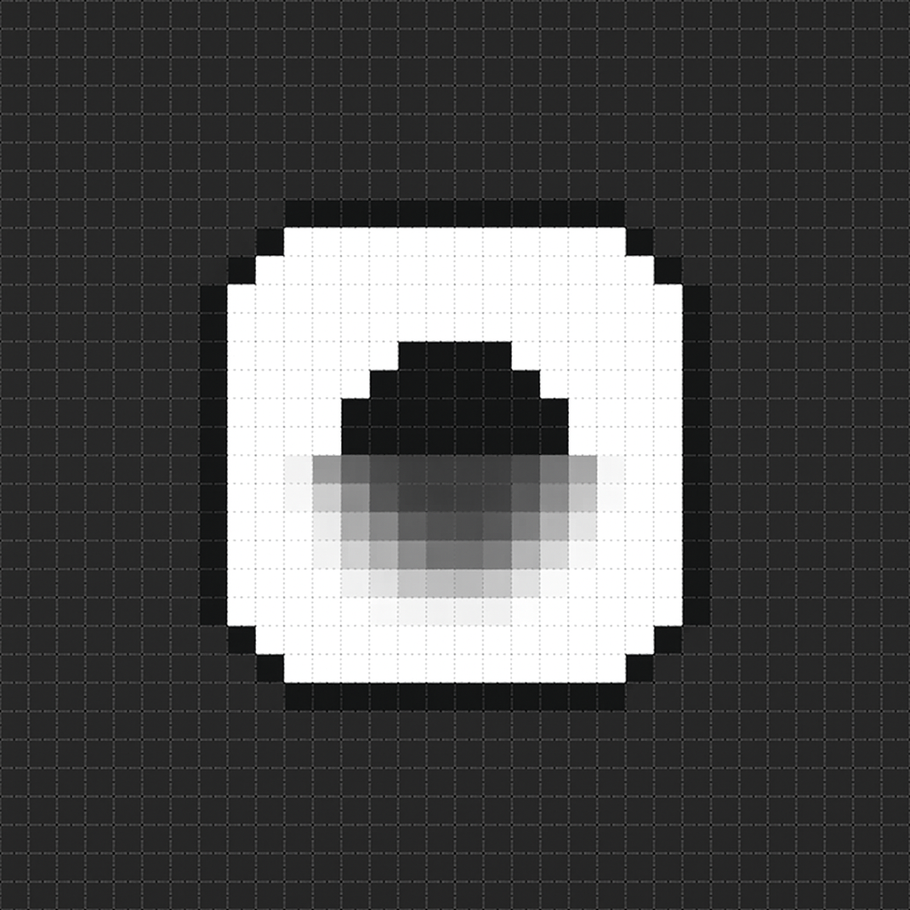

<h1 align="center" >Untitled UI Icons</h1>

### untitledui-js is a collection of simply beautiful open source icons for React.js sourced from Untitled UI. Each icon is designed on a 24x24 grid with an emphasis on simplicity, consistency and readability.

- ####  Supports `.js` `.ts` `.tsx` `.jsx` extensions and is completely typesafe
- ####  Features **1100+** icons sourced from [Untitled UI](https://www.untitledui.com/icons)
- ####  Compatible with [Framer motion](https://www.framer.com)
- ####  Compatible with React. Vue, Solid and Qwik versions in development

### Latest Updates:
- Optimized for Next js 13 app dir
- Improved stability


<h2 align="center">Quick Tutorial</h2>

 ### Installation :

```js
npm install untitledui-js
```

### Example :

```jsx
import { Home01 } from "untitledui-js/general";
import { General } from "untitledui-js"

const ExampleComponent = () => {
  return (
    <>
     <General.Home01 size="60px" stroke="2px"/>
     <Home01 size="60px" stroke="2px" />
    </>
  )
};

export default ExampleComponent;
```


<h1 align="center">Docs</h1>

## 1. Imports  
The icons can be imported via two ways, the first being through direct import of the icons :
   ```jsx
   import { HomeSmile } from "untitledui-js/general"
   ```
   or through category based import :
   ```jsx
   import { General } from "untitedui-js"
   ```
   we adice you use direct imports except you are familiar with untitled ui's icon categories and the icons in each category
## 2. Props 
The icons are compatible with all the props that are available to the regular svg component but with some added props to allow compatibility with other libraries, customizability and improve development speed  

**Note**: All icons support framer motion's animation props, you can use them directly 
```tsx
<Home01 animate={}/>
```
or passing them into `pathProps` which adds the animation properties to the path components

```jsx
<Home01 pathProps={{
  animate: ""
}}/>
```

<div align="center">

Added Props|Types| Definition|Example|
|----|-----|-----------|-------|
size | `string` | defines both height and width properties of the icon | `<Home01 size="60px"/>`
pathProps | `React.SVGProps<SVGPathElement>` | allows for the adding of path props and framer motion path props to the path tag | `<Home01 pathProps{{clip-rule:"evenodd"}}/>` 

</div>


## 3. Naming Convention 
Components are defined with Camelcase. for example `home-01 -> Home01, activity-01 -> Activity01`

If you are not familiar with the icons in Untitled UI's icon pack you can visit [Untitled UI Icons]("https://www.untitleduiicons.com")
