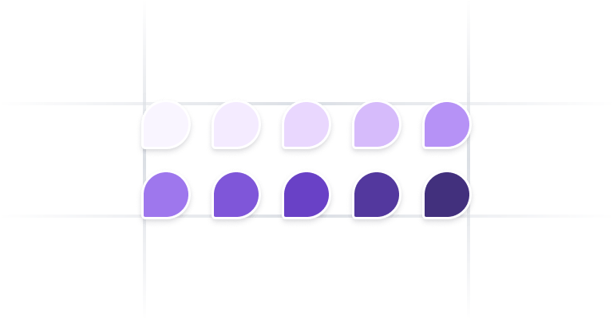

# Untitled UI - JS

A fully customizable collection of icons from untitled ui.

- Written in React Typescript
- All icons are sourced from Untitled UI's free pack
- Contributions are welcomed

# Docs

- npm install :

```js
npm install untitledui-js
```

- Usage :

```js
import { Home01 } from "untitledui-js";

const ExampleComponent = () => {
    width = "24"
    height = "24"
    fill = "none"
    strokeWidth = "2"
    strokeColor = "black"

  return (
    <Home01
      width={width}
      height={height}
      fill={fill}
      strokeWidth={strokeWidth}
      strokeColor={strokeColor}
    />
  );
};

export default ExampleComponent;
```

* Props : 

| Props     | Types |
| ----------- | ----------- |
| width     | string      |
| height   | string       |
| fill  | string       |
| strokeWidth  | string       |
| strokeColor  | string       |

# Available Icons


| Untitled Icon    | Naming Covention |
| ----------- | ----------- |
| home-01    | Home01      |
| home-02  | Home02      |
| home-03  | Home03       |
| home-04  | Home04       |
| home-05 | Home05      |
| home-smile | HomeSmile      |

* More icons will be added
* Contributions are welcomed
